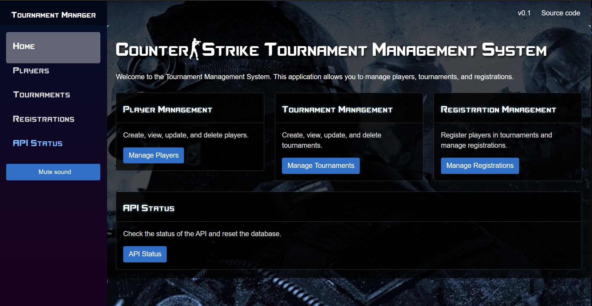

#   Tournament Management Application



## 1. Summary 

A RESTful web-application (client + server) for managing Counter-Strike tournaments. 

[](https://hexmerlin.github.io/Tournaments/index.html) **API docs**


## 2. Technology Stack
- **Backend:** ASP.NET Core Web API (with Azure hosting)
- **Entity Framework Core (EF Core)**
- **SQL Server** (for persistence)
- **REST architecture** (incl. HATEOAS)

- **Frontend:**
  - **Blazor WebAssembly App**
  - **HttpClient** (for API communication)
  - **CSS for styling** 
  - **Swagger UI** (for API testing and documentation)

## 3. Data Models

The core models of this application are as follows:

### 3.1 Player
- Represents an individual participating in tournaments.
- **Properties:**
  - **Gamertag** (globally unique, case-sensitive, primary key)
  - **Name** (not unique, modifiable)
  - **Age** (integer, between 1 and 200, modifiable)
- Players can exist independently of tournament registrations.

### 3.2 Tournament
- Represents a competitive event where players participate.
- **Properties:**
  - **Name** (unique identifier of the tournament, primary key)
  - **ParentTournament** (optional reference to a parent tournament)
- Tournaments can have sub-tournaments.
- Tournament nesting can be up to 5 levels deep (parent-child-child-child-child).

### 3.3 Registration
- Represents the relationship between a player and a tournament.
- **Properties:**
  - **Tournament** (reference to the tournament)
  - **Player** (reference to the player)
- Players can only register in a sub-tournament if they are already in the parent tournament.

## 4. Endpoints

### 4.1 API Discovery Endpoint
- GET /api → Entry point providing links to all available resources and operations, enabling clients to discover the complete API without prior knowledge of endpoints.
- GET / → Returns a JSON response with links to the API discovery endpoint and other relevant resources.

### 4.2 Player Endpoints
- `GET /api/players/{gamertag}` → Get player details.
- `POST /api/players` → Create a player. The player data, including the key gamertag, must be provided in the request body.
- `PUT /api/players/{gamertag}` → Update player details (except Gamertag). The updated player data must be provided in the request body.
- `DELETE /api/players/{gamertag}` → Delete a player.

### 4.3 Tournament Endpoints
- `GET /api/tournaments/{name}` → Retrieve tournament details.
- `GET /api/tournaments/{name}?include=sub-tournaments` → Retrieve tournament with sub-tournaments.
- `POST /api/tournaments` → Create a new tournament. The tournament data, including the key name, must be provided in the request body.
- `PUT /api/tournaments/{name}` → Update tournament details (except Name). The updated tournament data must be provided in the request body.
- `DELETE /api/tournaments/{name}` → Delete a tournament (and its sub-tournaments).

### 4.4 Registration Endpoints
- `POST /api/tournaments/{tournamentName}/players/{gamertag}` → Register a player in a tournament.
- `DELETE /api/registrations/{tournamentName}/{gamertag}` → Remove a player from a tournament.
- `GET /api/tournaments/{tournamentName}/players/{gamertag}` → Retrieve a specific registration.
- `GET /api/tournaments/{tournamentName}/players` → Retrieve all players registered in a tournament.

## 5. Data Constraints & Deletion Rules

- **Tournament Deletion:**
  - If a tournament is deleted, all its sub-tournaments are deleted.
  - All players registered in the tournament and its sub-tournaments are unregistered from these.
  - Players remain in other tournaments where they are registered.

- **Player Deletion:**
  - If a player is deleted, they are removed from all tournaments they were registered in.

- **Registration Constraints:**
  - Players can only register in a sub-tournament if they are already in the parent tournament.
  - Removing a player from a tournament also removes them from all sub-tournaments.

- All constraints are enforced at the API level, not in the database.

## 6. API Behavior & Error Handling

- Standard RESTful HTTP methods and status codes include:
  - `400` → Validation error (e.g., duplicate gamertag, invalid player registration). Responses are in JSON format following the ProblemDetails specification.
  - `404` → Resource not found.
  - `409` → Conflict (e.g., attempting to register a player already in a tournament).

- **Use ProblemDetails format for error responses.****Use ProblemDetails format for error responses.**

## 7. Misc Info
- Tournament retrieval allows optional embedding of sub-tournaments via `GET api/tournaments/{name}?include=sub-tournaments`.
- Since this is a demo project, we prioritize ease of use - no user logins or passwords are required.

## 8. Appendix. HATEOAS API Responses

The API adheres to to strict REST architectural constraints which implies HATEOAS (Hypermedia As The Engine Of Application State). 
Clients can discover available actions dynamically through hypermedia links embedded in responses, without relying on predefined knowledge of endpoint structures beyond the entry point. 
This ensures a self-descriptive, evolvable, and loosely coupled API, where interactions are guided by the API itself rather than external documentation.
API responses include relevant hypermedia links, allowing clients to dynamically navigate the system. Links use consistent relation names across resources.

For instance, as an entry-point, a 'GET /' request could return the following response:

```json
{
  "links": [
    {
      "href": "/api/players",
      "rel": "players",
      "method": "GET"
    },
    {
      "href": "/api/players",
      "rel": "create-player",
      "method": "POST"
    },
    {
      "href": "/api/players/{gamertag}",
      "rel": "get-player",
      "method": "GET"
    },
    {
      "href": "/api/players/{gamertag}",
      "rel": "update-player",
      "method": "PUT"
    },
    {
      "href": "/api/players/{gamertag}",
      "rel": "delete-player",
      "method": "DELETE"
    },
    {
      "href": "/api/tournaments",
      "rel": "tournaments",
      "method": "GET"
    },
    {
      "href": "/api/tournaments",
      "rel": "create-tournament",
      "method": "POST"
    },
    {
      "href": "/api/tournaments/{name}",
      "rel": "get-tournament",
      "method": "GET"
    },
    {
      "href": "/api/tournaments/{name}",
      "rel": "update-tournament",
      "method": "PUT"
    },
    {
      "href": "/api/tournaments/{name}",
      "rel": "delete-tournament",
      "method": "DELETE"
    },
    {
      "href": "/api/registrations",
      "rel": "registrations",
      "method": "GET"
    },
    {
      "href": "/api/registrations/{id}",
      "rel": "get-registration",
      "method": "GET"
    },
    {
      "href": "/api/registrations/{id}",
      "rel": "update-registration",
      "method": "PUT"
    },
    {
      "href": "/api/registrations/{id}",
      "rel": "delete-registration",
      "method": "DELETE"
    },
    {
      "href": "/api/status",
      "rel": "api-status",
      "method": "GET"
    }
  ]
}
```
Another example response with some populated data (tournament with registered players):

```json
{
  "tournament": {
    "name": "PGL-Major",
    "parentTournamentName": null
  },
  "players": [
    {
      "gamertag": "HexMerlin",
      "links": [
        { "href": "/api/players/HexMerlin", "rel": "self", "method": "GET" },
        { "href": "/api/players/HexMerlin", "rel": "update", "method": "PUT" },
        { "href": "/api/registrations/PGL-Major/HexMerlin", "rel": "delete", "method": "DELETE" }
      ]
    },
    {
      "gamertag": "ShadowValkyrie",
      "links": [
        { "href": "/api/players/ShadowValkyrie", "rel": "self", "method": "GET" },
        { "href": "/api/players/ShadowValkyrie", "rel": "update", "method": "PUT" },
        { "href": "/api/registrations/PGL-Major/ShadowValkyrie", "rel": "delete", "method": "DELETE" }
      ]
    }
  ],
  "links": [
    { "href": "/api/tournaments/PGL-Major", "rel": "self", "method": "GET" },
    { "href": "/api/tournaments/PGL-Major", "rel": "update", "method": "PUT" },
    { "href": "/api/tournaments/PGL-Major", "rel": "delete", "method": "DELETE" },
    { "href": "/api/tournaments/PGL-Major?include=sub-tournaments", "rel": "sub-tournaments", "method": "GET" },
    { "href": "/api/tournaments/PGL-Major/players/{gamertag}", "rel": "register-player", "method": "POST" },
    { "href": "/api/tournaments/PGL-Major/players", "rel": "registered-players", "method": "GET" }
  ]
}


```